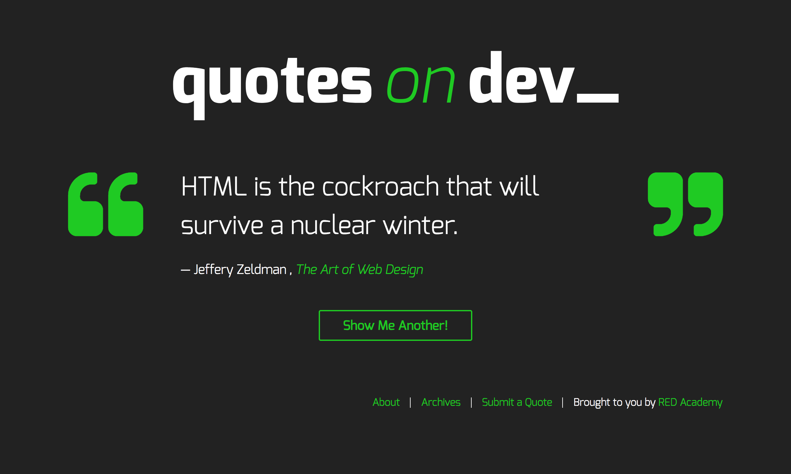
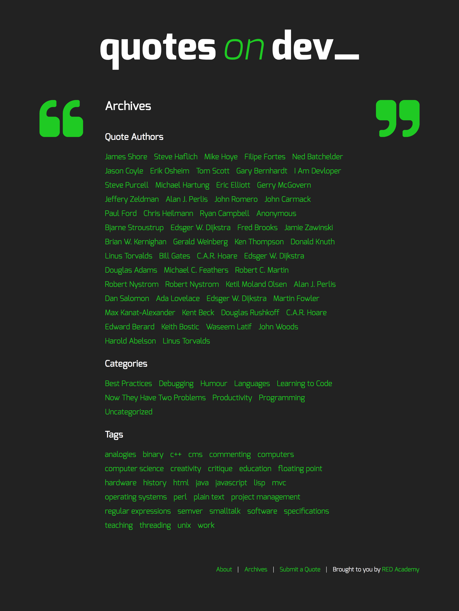
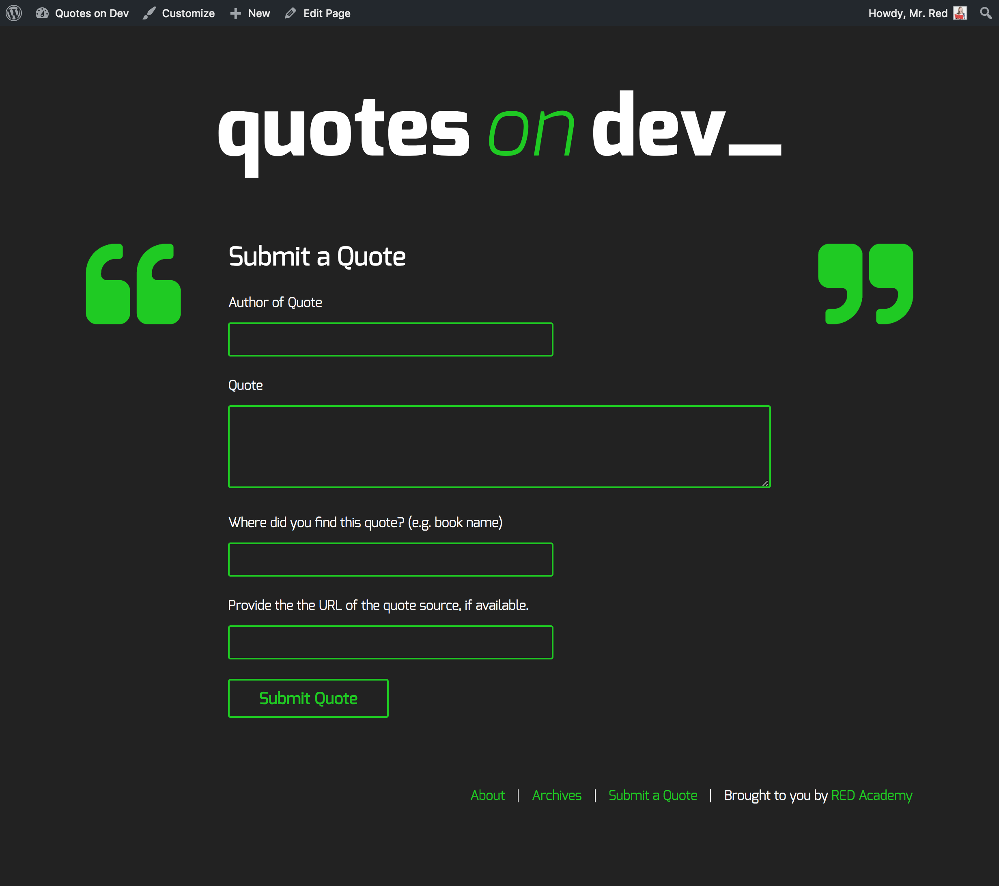
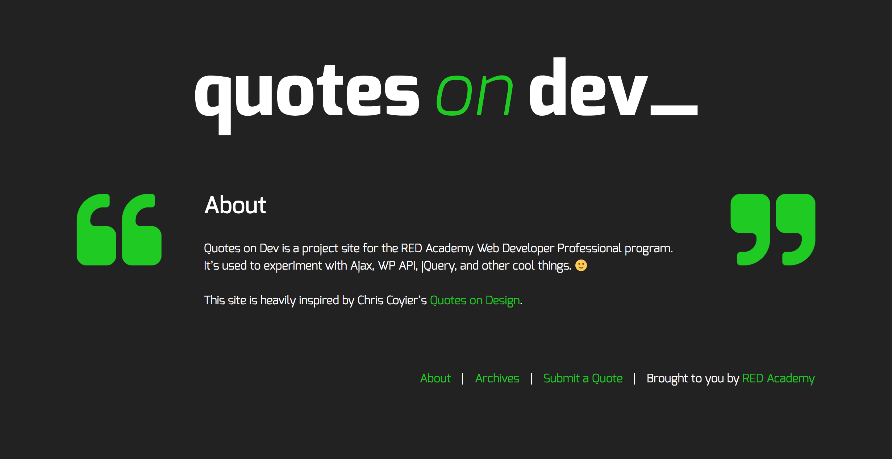
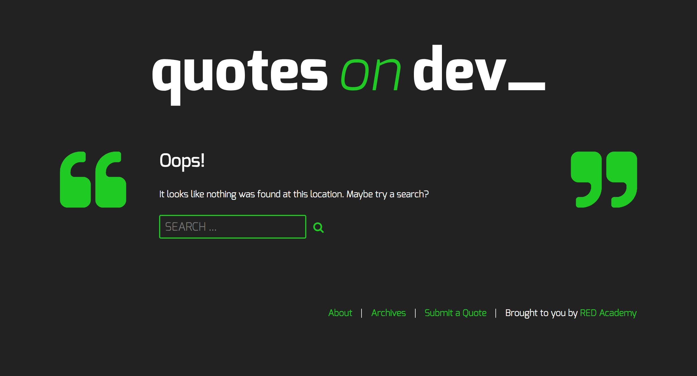
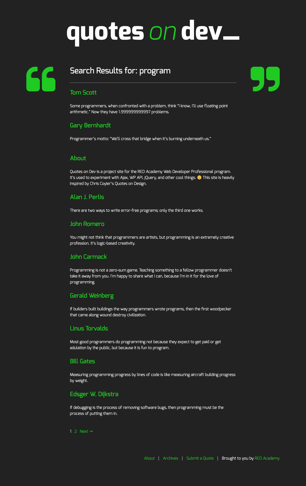

# Quotes on Dev

This is a WordPress theme for the Quotes on Dev project in RED Academy, forked from Underscores. This project is a good showcase of applying PHP, CSS, REST Api, and JavaScript.

## Home page
The home page shows a random post, and the button is for loading one a new random post on the page using JavaScript and REST Api. This page uses home.php template. The click function using 'get' method to get content from the server.

## Archive page
The archive page shows all authors, categories and tags in this website. There is a template called page-archive.php for this page. For each category and tags, they use archive.php template.

## Submit page
This website allow the admin user to submit new quotes on this page. If the user is not logged in, the input form doesn't show up. The submit function is based on REST Api. A nonce can be generated to make sure the security. It uses 'post' method to send message.

## Other pages
An about page can show some information about this website. When target url cannot be found, there is a 404 page. And it provide a search function to search this website.

## Installation
### 1. Download me (don't clone me!)

Then add the theme folder in `themes` to your `wp-content -> themes`.

### 2. Activate the themes

Then the theme can be applied.

### 3. Add demo content to Post
tool->import->WordPress->select the file in quotesondev theme
`/themes/quotesondev/assets/quotesondev.wordpress.2018-06-19.xml`